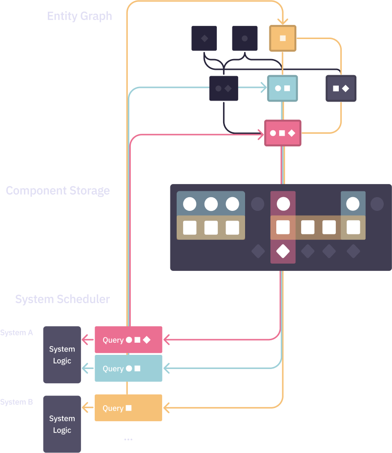

# What is Javelin?

Javelin is an [Entity Component System](https://github.com/SanderMertens/ecs-faq#what-is-ecs) (ECS) framework for TypeScript and JavaScript. It draws inspiration from other ECS frameworks like [Bevy](https://bevyengine.org/) and [Flecs](https://www.flecs.dev/flecs/) to provide an ergonomic, performant, and interoperable way of creating games in JavaScript.

## Features

Systems with reactive entity queries.

```ts
function lootSystem() {
  world.of(Player).each((player, playerBox) => {
    world.of(Loot).each((loot, lootBox) => {
      // (pick up loot bag)
    })
  })
}
```

A scheduler with run criteria, ordering constraints, and system groups.

```ts
function weatherEnabled(world: World) {
  return world.getResource(Config).weatherEnabled
}
game
  .addSystem(shootSystem)
  .addSystem(lootSystem, _ => _.after(shootSystem))
  .addSystem(weatherSystem, null, weatherEnabled)
  .addSystemToGroup(Group.Late, renderSystem)
```

A type system used to create, add, and remove sets of components from entities. 

```ts
let Transform = type(Position, Rotation, Scale)
let Mesh = type(Geometry, Material)
let Player = type(Transform, Mesh)

world.create(Player)
```

Enum components used to safeguard entity composition and implement state machines.

```ts
let PlanetType = slot(Gas, Rock)
// Error: A type can have at most one component for a given slot
type(PlanetType(Gas), PlanetType(Rock))
````

Entity relationships with built-in support for heirarchies.

```ts
let parent = world.create()
let child = world.create(ChildOf(parent))
world.delete(parent) // also deletes `child`
```

And much more! Move to the next chapter to learn how to build a simple game with Javelin.

## Design




