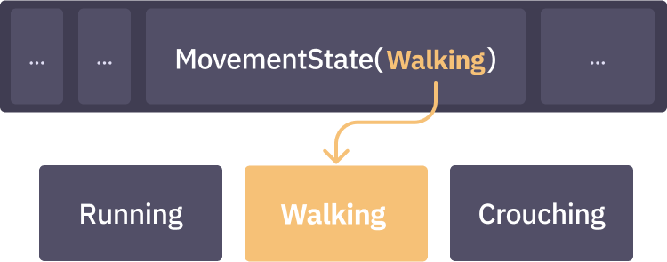
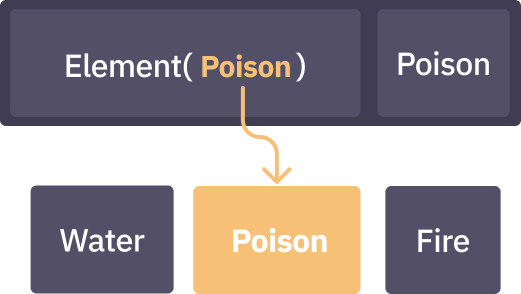

# Enums

Enum-like behavior can be achieved using **slots**. Slots are useful when defining mutually exclusive states, like when implementing character movement systems.

Slots are created using the `slot` function. They are defined with one or more value or tag components.

```ts
let MovementState = j.slot(Running, Walking, Crouching)
```

Slot components are added to entities like any other component. To create a slot component, call the slot (in this case `MovementState`) with one of its components.

```ts
world.create(MovementState(Walking))
```



> Slots cannot be defined with [relationships](./components-relationships.md). For example, `ChildOf(*)` is not a valid slot component.

A slot guarantees that **at most one** of the components included in its defintion may be attached to an entity.

```ts
let character = world.create(MovementState(Walking))
world.add(character, MovementState(Running))
// Error: A type may have at most one component for a given slot
```

You can find entities with a given slot by including the slot in a query's terms.

```ts
world.query(MovementState).each(entity => {
  // `entity` has a `MovementState`
})
```

Slots are implemented as [relation components](./components-relationships.md), so they follow the same semantics. This also means that a slot produces unique components that are independent of those it was defined with. Below is an example of a type that uses a slot to ensure the entity has at most one element (e.g. water, fire, poison), while also integrating another `Poison` component value for a separate use.

```ts
j.type(Element(Poison), Poison)
```


