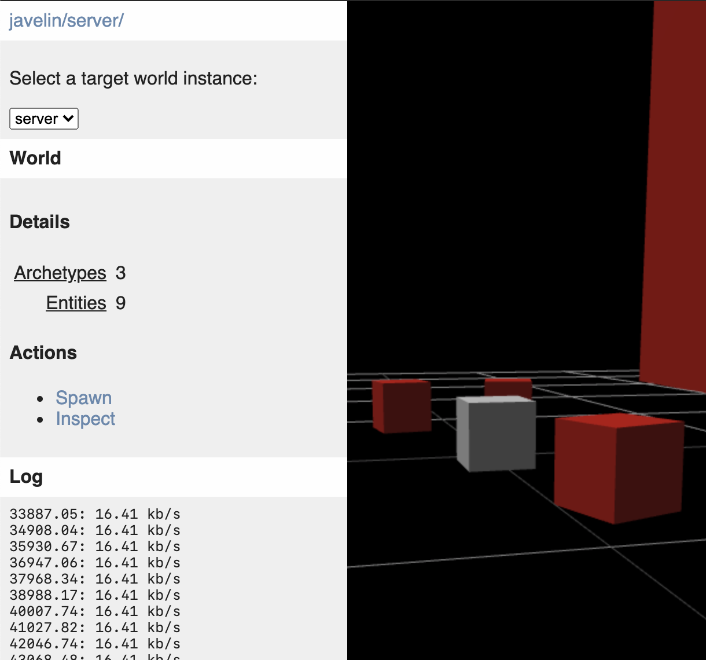

# `@javelin/devtool`

Developer tool for Javelin ECS.

<p align="center">
  
</p>

## Usage

```ts
import { createDevtool } from "@javelin/devtool"
import { createMessageHandler } from "@javelin/ecs"

const systems = []
const world = createWorld(systems)
const messageHandler = createMessageHandler({ world })
const devtool = createDevtool({
  worlds: {
    client: world,
  },
  onMessage(world, message) {
    messageHandler.applyMessage(message)
  },
})

devtool.mount(document.getElementById("devtool"))
```
