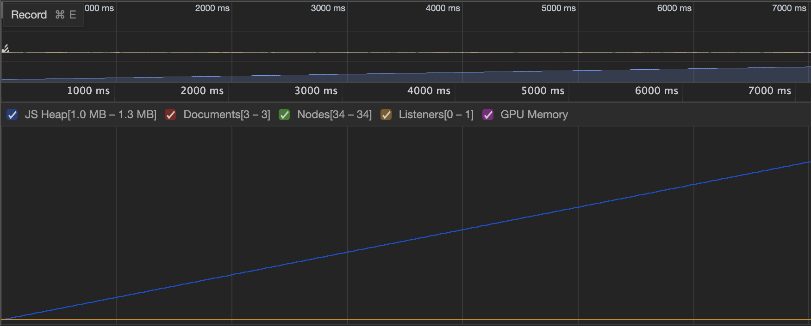
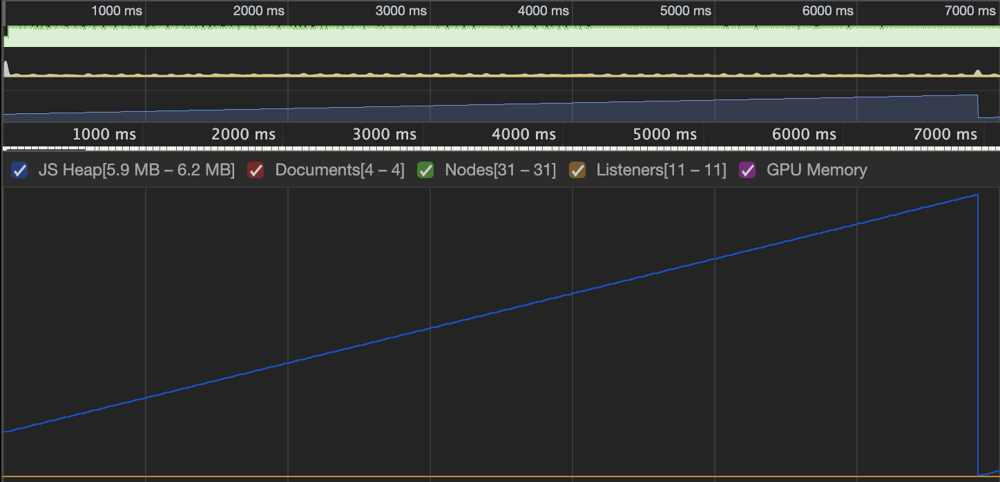

# `@javelin/ecs`

A TypeScript Entity-Component System (ECS) for Node and web browsers.

## Docs

https://3mcd.github.io/javelin

## Primer

ECS is a pattern commonly used in game development to associate **components** (state) with stateless **entities** (game objects). **Systems** then operate on collections of entities of shared composition.

For example, a system could add a `Burn` component to entities with `Position` and `Health` components when their position intersects with a lava pit.

## Features

- **Performant**
  - Entities are organized by component makeup into Archetypes for fast iteration
  - Entities can be tagged with bit flags for quick filtering
- **Ergonomic**
  - Minimal API
  - No classes or inheritance
- **Unopinionated**
  - Leaves many opinions up to you, meaning it can be integrated with other packages or pre-existing projects

## Performance

Javelin ECS uses very little memory and thus produces very little garbage. Below is a screenshot of an allocation timeline where 10k entities are iterated by 3 systems per tick at 60Hz. The memory growth (0.3mb) is consistent with standard `setInterval` or `requestAnimationFrame` performance and there is no "sawtooth" pattern of frequent, minor GC events.

Allocation timeline of simple `requestAnimationFrame` loop:


Allocation timeline of `requestAnimationFrame` loop, 10k entities iterated per tick:


Run `yarn perf` to run performance tests.

Example perf on 2018 MacBook Pro where 630k entities are iterated per tick at ~60 FPS:

```
========================================
perf_storage
========================================
create: 229.866ms
run: 15520.090ms
destroy: 13.510ms
entities      | 540000
components    | 4
queries       | 4
ticks         | 1000
iter          | 630630000
iter_tick     | 630630
avg_tick      | 15.987ms
========================================
perf_storage_pooled
========================================
create: 281.043ms
run: 15997.922ms
destroy: 14.744ms
entities      | 540000
components    | 4
queries       | 4
ticks         | 1000
iter          | 630630000
iter_tick     | 630630
avg_tick      | 16.52ms

```
