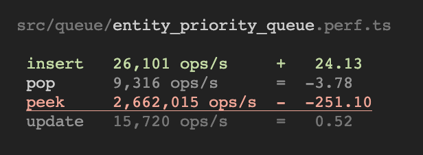

# @javelin/perf

<p align="center">
  
</p>

A runnerless, single-threaded benchmarking library for Node.

## Getting Started

```sh
npm i @javelin/perf
```

src/fibonacci.perf.ts

```ts
import {fibonacci} from "./fibonacci"
import {perf} from "@javelin/perf"

perf("100 elements", () => fibonacci(100))
```

```sh
> ts-node src/fibonacci.perf.ts

src/fibonacci.perf.ts

 100 elements   106,321 ops/s     =   4.13
```

### Setup

```ts
perf("iterator next()", () => {
  let f = make_fibonacci({start: 1_000})
  return () => f.next()
})
```

### Options

Run just a single benchmark in a file:

```ts
perf.only("name", () => {})
```

Don't throw an error when a benchmark degrades in performance.

```ts
perf("name", () => {}, {
  throwOnFailure: false,
})
```
